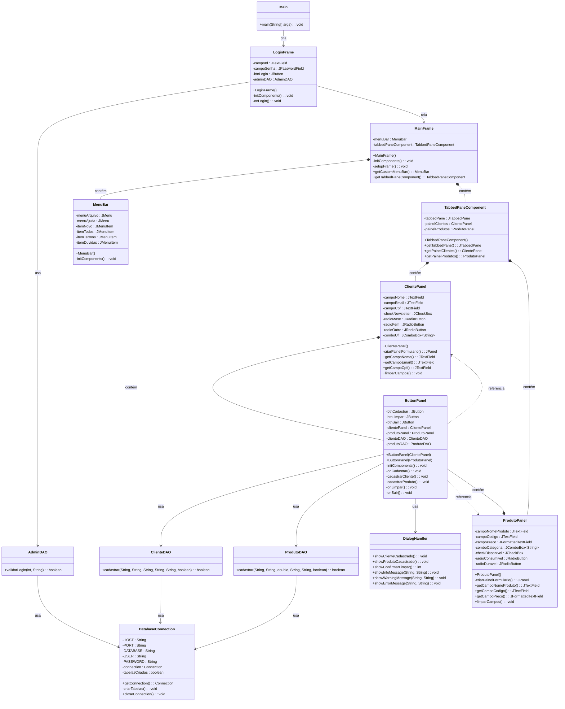

# 📊 Diagrama de Classes - Sistema de Cadastro

## Diagrama UML



## 📦 Estrutura de Pacotes

```
br.com.pi
├── Main
│
├── ui (Interface Gráfica)
│   ├── LoginFrame
│   ├── MainFrame
│   ├── MenuBar
│   ├── TabbedPaneComponent
│   ├── ClientePanel
│   ├── ProdutoPanel
│   ├── ButtonPanel
│   └── DialogHandler
│
├── dao (Data Access Objects)
│   ├── AdminDAO
│   ├── ClienteDAO
│   └── ProdutoDAO
│
└── db (Banco de Dados)
    └── DatabaseConnection
```

## 🔗 Relacionamentos Principais

1. **Main** → Cria e inicia **LoginFrame**
2. **LoginFrame** → Usa **AdminDAO** para validar login → Cria **MainFrame** se válido
3. **MainFrame** → Contém **MenuBar** e **TabbedPaneComponent**
4. **TabbedPaneComponent** → Contém **ClientePanel** e **ProdutoPanel**
5. **ClientePanel/ProdutoPanel** → Contém **ButtonPanel**
6. **ButtonPanel** → Usa **ClienteDAO/ProdutoDAO** e **DialogHandler**
7. **Todos os DAOs** → Usam **DatabaseConnection** para acessar o banco

## 📝 Legenda

- **+** = público (public)
- **-** = privado (private)
- **→** = relacionamento de uso/criação
- **contém** = composição (um objeto contém outro)
- **usa** = dependência (um objeto usa outro)

